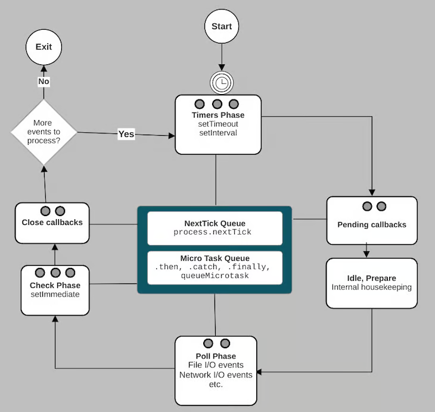
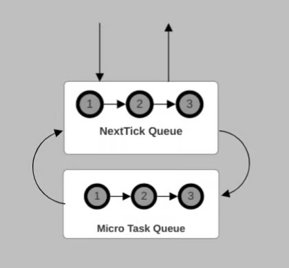
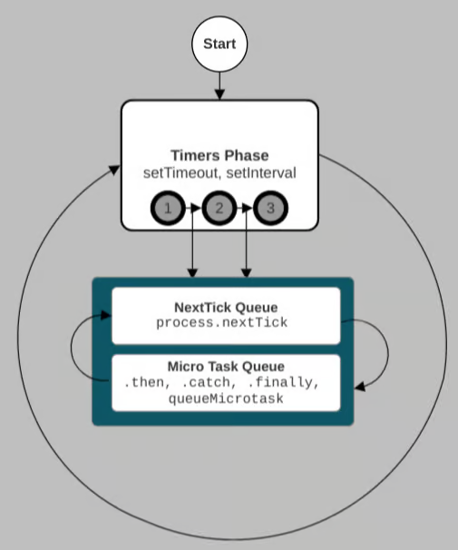

The Node.js event loop functions as a semi-infinite loop, running continuously until all pending asynchronous tasks are completed. When you initiate a Node.js process using the "node" command, your JavaScript code is executed, and the event loop is initialized. If Node.js encounter an asynchronous task like timers, file operations, or network I/O during script execution, it delegates these tasks to either the native system or a thread pool.

Many I/O operations, including file read/write, encryption/decryption, and networking, are resource-intensive and time-consuming. To prevent blocking the main thread, Node.js delegates these operations to the native system, allowing them to run concurrently alongside the Node process.

Modern operating system kernels are inherently multi-threaded, enabling them to handle multiple operations simultaneously and notify Node.js upon their completion. The event loop manages the execution of asynchronous API callbacks and comprises six primary phases:

1. Timers Phase: Responsible for managing setTimeout and setInterval callbacks.
2. Pending Callbacks Phase: Executes deferred callbacks.
3. Idle and Prepare Phase: Used by the event loop for internal maintenance tasks.
4. Poll Phase: Polls and handles events such as file and network I/O.
5. Check Phase: Executes setImmediate callbacks.
6. Close Phase: Handles specific close events.

While the description above presents the phases of the event loop in a linear manner, it's important to understand that the event loop itself is cyclical and iterative. It continuously cycles through the different phases to handle various tasks efficiently.

Here's a visual representation of how the event loop operates:


After completing the last phase of the event loop, if there are still pending events or asynchronous operations, the event loop starts another iteration to handle them. However, if there are no more pending tasks, the Node.js process exits, and the program terminates.

Before delving into the details of each phase of the event loop, it's important to understand the concepts of the "next tick" queue and microtask queue, which appear at the center of the event loop diagram.

## Microtask queue

Promises, queueMicrotask, and process.nextTick are all part of the asynchronous API in Node.js. When promises settle, queueMicrotask and the .then, .catch, and .finally callbacks are added to the microtask queue.

On the other hand, the process.nextTick callbacks belong to the “next tick” queue. Let’s use the example below to illustrate how the microtask and the “next tick” queues are processed:

```js
setTimeout(() => {
  console.log('setTimeout 1')

  Promise.resolve('Promise 1').then(console.log)
  Promise.reject('Promise 2').catch(console.log)
  queueMicrotask(() => console.log('queueMicrotask 1'))

  process.nextTick(console.log, 'nextTick 1')
}, 0)

setTimeout(console.log, 0, 'setTimeout 2')

setTimeout(console.log, 0, 'setTimeout 3')
```

Let’s assume the three timers above expire at the same time. When the event loop enters the timers phase, it will add the expired timers to the timers callback queue and execute them from the first to the last.

In our example code above, when executing the first callback in the timers queue, the .then, .catch, and queueMicrotask callbacks are added to the microtask queue. Similarly, the process.nextTick callback is added to a queue that we will refer to as the “next tick” queue. Be aware, console.log is synchronous.

When the timer queue’s first callback returns, the “next tick” queue is processed. If more “next ticks” are generated while processing callbacks in the “next tick” queue, they are added to the back of the “next tick” queue and executed as well.

When the “next tick” queue is empty, the microtask queue is processed next. If the microtasks generate more microtasks, they are also added to the back of the microtask queue and executed.

When both the “next tick” queue and microtask queue are empty, the event loop executes the second callback in the timer queue. The same process continues until the timer queue is empty.



The process described above is not limited to the timer phase. The “next tick” queue and the microtask queue are processed similarly when the event loop executes JavaScript in all the other major phases.

## Phases of event loop

As described earlier, the Node.js event loop operates as a semi-infinite loop comprising six primary phases. While additional phases exist, they serve internal housekeeping purposes and do not directly impact your code execution. Hence, we'll exclude them from discussion here.

Each primary phase maintains a first-in-first-out queue of callbacks. For instance, the operating system manages scheduled timers until their expiration. After that, these expired timers join the timers callback queue.

Afterwards, the event loop proceeds to execute the callbacks within the timers queue until it's empty or reaches a maximum callback threshold. Below, we'll delve into the primary phases of the event loop.

### Timers Phase

Similar to web browsers, Node.js also offers a timers API for scheduling future function executions. While resembling the browser timers API, there are slight differences in implementation.

The Node.js timers API includes setTimeout, setInterval, and setImmediate functions, all of which operate asynchronously. Within the event loop, the timers phase manages setTimeout and setInterval exclusively.

Conversely, the check phase oversees the setImmediate function, which we'll discuss later. Both setTimeout and setInterval share the following function signature:

```js
setTimeout(callback, delay, [...args])
setInterval(callback, delay, [...args])
```

Here:

- **callback** refers to the function to execute when the timer expires.
- **delay** denotes the milliseconds to wait before invoking the callback, with a default of one millisecond.
- **args** are optional arguments passed to the callback.
  In setTimeout, the callback executes once after the specified delay, while setInterval schedules callback to run repeatedly at intervals of delay milliseconds.

The diagram below shows the event loop after removing all the phases except the timers phase:


To simplify, let's consider three setTimeout functions scheduled to expire simultaneously. When the event loop enters the timer phase, the following steps occur:

1. The three expired timers are added to the timers queue.
2. The event loop executes the first setTimeout callback. If additional "next ticks" or microtasks are generated during execution, they are queued accordingly.
3. After executing the first callback, the event loop processes the "next tick" queue. If more "next ticks" are generated during this process, they are queued for immediate execution. Any generated microtasks are also added to the microtask queue.
4. Once the "next tick" queue is empty, the event loop proceeds to process the microtask queue. Any additional microtasks generated are appended to the queue for immediate execution.
5. If both the "next tick" queue and microtask queue are empty, the event loop moves on to execute the second callback in the timers queue. These steps repeat for subsequent callbacks.
6. The event loop continues processing the timers queue until it's empty or reaches the maximum callback limit before transitioning to the next phase.

While we've illustrated using a queue of three expired timers, this scenario may vary in practice. The event loop handles the timers queue until it's empty or reaches the maximum callback limit.

It's important to note that executing JavaScript callbacks blocks the event loop. If a callback takes a long time to process, it delays the event loop's progress, potentially causing performance issues, particularly in server-side applications where Node.js operates.

Additionally, the delay parameter you specify in timer functions represents the minimum waiting time before executing the callback, not the exact duration. The actual delay depends on the event loop's workload and the system timer's behavior.

### Pending callbacks

During the polling phase, which we'll discuss shortly, the event loop actively searches for events like file and network I/O operations. While some events are handled within the poll phase itself, others are deferred to the pending phase in the subsequent iteration of the event loop.

In the pending phase, any deferred events are placed in the pending callbacks queue for execution. This phase primarily deals with specific events, such as certain TCP socket errors emitted by the system. For instance, certain operating systems postpone the handling of ECONNREFUSED error events until this phase.

### Idle, prepare

The event loop utilizes the idle, prepare phase for internal maintenance tasks, which do not directly impact the Node.js code you write. Though we won't delve into its specifics, it's important to acknowledge its existence.

### Poll Phase

During the poll phase, two main functions are performed. Firstly, it processes events in the poll queue and executes their associated callbacks. Secondly, it determines the duration to block the event loop and poll for I/O events.

When the event loop enters the poll phase, it places pending I/O events in the queue and executes them until the queue is empty or a system-specific limit is reached. Similar to other phases, the "next tick" and microtask queues are emptied between the execution of JavaScript callbacks.

Unlike other phases, the poll phase may intermittently block the event loop for a specified duration to poll for I/O events until either the timeout expires or the maximum callback limit is reached.

Various factors influence the event loop's decision to block and the duration of the block, including the availability of pending I/O events and the status of other phases such as the timers phase.

### Check Phase

The event loop triggers the setImmediate callback during the check phase immediately after I/O events. The setImmediate function is defined as follows:

`setImmediate(callback, [...args])`

Here, callback represents the function to execute, while args are optional arguments passed to the callback.

Multiple setImmediate callbacks are handled in the order they're created. In a given example, if the event loop executes an fs.readFile callback during the poll phase due to an I/O operation, subsequent setImmediate callbacks will be processed immediately in the check phase within the same iteration of the event loop. Conversely, setTimeout callbacks will be addressed in the timers phase during the next iteration of the event loop.

When setImmediate is invoked within an I/O callback, as shown in the example below, the event loop ensures its execution during the check phase within the same iteration:

```js
const fs = require('fs')

let counter = 0

fs.readFile('path/to/file', { encoding: 'utf8' }, () => {
  console.log(`Inside I/O, counter = ${++counter}`)

  setImmediate(() => {
    console.log(`setImmediate 1 from I/O callback, counter = ${++counter}`)
  })

  setTimeout(() => {
    console.log(`setTimeout from I/O callback, counter = ${++counter}`)
  }, 0)

  setImmediate(() => {
    console.log(`setImmediate 2 from I/O callback, counter = ${++counter}`)
  })
})
```

Micro tasks and "next ticks" originating from setImmediate callbacks during the check phase are appended to the microtask queue and "next tick" queue, respectively. Subsequently, they are immediately processed, mirroring the behavior observed in other event loop phases.

### Close Phase

During the close phase, Node.js executes callbacks to conclude events and finalize a particular event loop iteration. For instance, when a socket is closed, the event loop handles the close event in this phase. Any "next ticks" and microtasks generated during this phase are handled similarly to other phases of the event loop.

It's important to note that you have the ability to terminate the event loop at any phase by calling the process.exit method. This action will result in the Node.js process exiting, disregarding any pending asynchronous operations.
